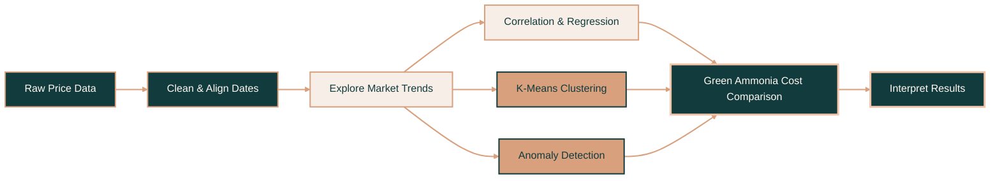

<div id="top"></div>

<br>

<!-- Header Badges -->

<p align="center">
  <a href="https://github.com/soph-k">
    
  </a>
  <a href="https://www.python.org/">
    
  </a>
  <a href="https://jupyter.org/">
    
  </a>
  <a href="https://github.com/soph-k/ammonia-shock-analysis">
    
  </a>
  <a href="https://github.com/soph-k/ammonia-shock-analysis">
    
  </a>
</p>

<br>

<!-- Header -->

<div align="center">

<a href="https://github.com/soph-k">
  
</a>

<h2>『 U.S. Ammonia Shock Analysis 』</h2>

<p>
  Exploring how natural gas prices and geopolitical disruptions influenced
  U.S. ammonia-related producer prices—and when green ammonia became more competitive.
</p>

<p>────── ♡ ──────</p>

<p>
  <a href="https://github.com/soph-k/ammonia-shock-analysis/blob/main/ammonia_notebook.ipynb">
    <strong>View Notebook »</strong>
  </a>
  &nbsp; • &nbsp;
  <a href="https://colab.research.google.com/github/soph-k/ammonia-shock-analysis/blob/main/ammonia_notebook.ipynb">
    <strong>Open in Colab »</strong>
  </a>
</p>

</div>

<br>

<!-- Table of Contents -->

## ❐ Table of Contents

<details>
<summary><strong>Quick Links</strong></summary>

<ol>
  <li><a href="#about-the-project">About the Project</a></li>
  <li><a href="#project-overview">Project Overview</a></li>
  <li><a href="#analysis-workflow">Analysis Workflow</a></li>
  <li><a href="#key-findings">Key Findings</a></li>
  <li><a href="#built-with">Built With</a></li>
  <li><a href="#data">Data</a></li>
  <li><a href="#getting-started">Getting Started</a></li>
  <li><a href="#limitations">Limitations</a></li>
  <li><a href="#acknowledgments">Acknowledgments</a></li>
</ol>

</details>

<br>

<!-- About -->

<div id="about-the-project"></div>

## ❐ About the Project

This project analyzes the relationship between U.S. natural gas prices and
ammonia-related producer prices before and after major geopolitical disruptions.

The notebook combines statistical analysis and machine learning to explore:

- How ammonia-related prices changed across major market periods
- Whether ammonia prices became more closely tied to natural gas during disruptions
- Whether unsupervised learning could identify high-price market regimes
- Which months showed statistically unusual price behavior
- When estimated conventional ammonia costs approached published green-ammonia costs

> **Why it matters:** ammonia production is closely tied to energy costs, so disruptions in natural gas markets can influence fertilizer prices and the relative competitiveness of green ammonia.

<p align="right">(<a href="#top">back to top</a>)</p>

<br>

<!-- Project Overview -->

<div id="project-overview"></div>

## ❐ Project Overview

<p align="center">
  <a href="https://github.com/soph-k/ammonia-shock-analysis/blob/main/ammonia_notebook.ipynb">
    
  </a>
</p>

<p align="center">
  <sub>Natural gas and ammonia-related prices across major geopolitical disruption periods</sub>
</p>

<br>

<p align="center">
  
  
  
</p>

<p align="center">
  
  
</p>

### Market Periods

| Period | Description |
|---|---|
| **Pre-War** | Baseline market conditions before February 2022 |
| **2022 Russia–Ukraine** | Major energy and fertilizer disruption period |
| **2024–2025 Tension** | Intermediate post-shock market period |
| **2026 Hormuz** | Early observations during a second disruption period |

<p align="right">(<a href="#top">back to top</a>)</p>

<br>

<!-- Analysis Workflow -->

<div id="analysis-workflow"></div>

## ❐ Analysis Workflow



### Methods

<p align="center">
  <code>Exploratory Data Analysis</code>
  &nbsp; • &nbsp;
  <code>Correlation</code>
  &nbsp; • &nbsp;
  <code>Regression</code>
  &nbsp; • &nbsp;
  <code>Lag Analysis</code>
</p>

<p align="center">
  <code>K-Means Clustering</code>
  &nbsp; • &nbsp;
  <code>Anomaly Detection</code>
  &nbsp; • &nbsp;
  <code>Cost Comparison</code>
</p>

<p align="right">(<a href="#top">back to top</a>)</p>

<br>

<!-- Key Findings -->

<div id="key-findings"></div>

## ❐ Key Findings

### 1. Prices increased sharply during the 2022 disruption

Both natural gas and ammonia-related producer prices rose substantially compared
with the pre-war period. The ammonia-related price index showed an especially
large increase.

### 2. The gas–ammonia relationship became stronger during disruption

Natural gas and ammonia-related prices had a strong overall positive relationship.
The period-specific analysis indicated that this relationship became stronger
during the 2022 market shock.

### 3. Elevated ammonia prices remained after gas prices declined

During 2024–2025, average natural gas prices moved closer to their earlier level,
while the ammonia-related producer-price index remained elevated.

### 4. Machine learning identified a high-price market regime

K-means clustering selected a two-cluster solution that separated typical market
conditions from observations associated with elevated prices.

### 5. Green ammonia became more competitive during price shocks

Estimated conventional ammonia costs remained below the green-ammonia range for
most of the analysis, but the gap narrowed during the highest-price periods.

<p align="right">(<a href="#top">back to top</a>)</p>

<br>

<!-- Built With -->

<div id="built-with"></div>

## ❐ Built With

<p align="center">
  
  
  
  
  
</p>

<p align="center">
  
  
  
  
  
</p>

<p align="center">
  <sub>Data analysis • Machine learning • Visualization • Reproducible research</sub>
</p>

<p align="right">(<a href="#top">back to top</a>)</p>

<br>

<!-- Data -->

<div id="data"></div>

## ❐ Data

| File | Description |
|---|---|
| `MHHNGSP.csv` | Monthly Henry Hub natural gas spot prices |
| `WPU0652013A.csv` | Producer Price Index for ammonia and related nitrogen compounds |
| `The importance of dynamic operation...xlsx` | Published green-ammonia production-cost estimates |

### Repository Structure

```text
ammonia-shock-analysis/
├── data/
│   ├── MHHNGSP.csv
│   ├── WPU0652013A.csv
│   └── The importance of dynamic operation and renewable energy source
│       on the economic feasibility of green ammonia.xlsx
├── ammonia_notebook.ipynb
└── README.md
```

<p align="right">(<a href="#top">back to top</a>)</p>

<br>

<!-- Getting Started -->

<div id="getting-started"></div>

## ▹ Getting Started

### ❐ Prerequisites

Make sure you have:

- Python 3.10 or newer
- Git
- Jupyter Notebook or JupyterLab

### ❐ Installation

Clone the repository:

```sh
git clone https://github.com/soph-k/ammonia-shock-analysis.git
cd ammonia-shock-analysis
```

Create a virtual environment:

```sh
python -m venv .venv
```

Activate it on Windows:

```powershell
.venv\Scripts\Activate.ps1
```

Activate it on macOS or Linux:

```sh
source .venv/bin/activate
```

Install the required libraries:

```sh
pip install pandas numpy scipy scikit-learn matplotlib seaborn openpyxl jupyter
```

Open the notebook:

```sh
jupyter notebook ammonia_notebook.ipynb
```

Run the notebook cells from top to bottom to reproduce the analysis.

<p align="right">(<a href="#top">back to top</a>)</p>

<br>

<!-- Limitations -->

<div id="limitations"></div>

## ❐ Limitations

- The producer-price series represents ammonia and related nitrogen compounds rather than a pure ammonia-only spot-price series.
- The conventional ammonia cost comparison is an estimate based on a price-index baseline.
- The early-2026 period contains only a small number of observations.
- Correlation and regression show relationships but do not prove that geopolitical events directly caused the observed price changes.
- Monthly data may hide shorter price movements occurring within each month.

<p align="right">(<a href="#top">back to top</a>)</p>

<br>

<!-- Acknowledgments -->

<div id="acknowledgments"></div>

## ▹ Acknowledgments

This project uses:

- Henry Hub Natural Gas Spot Price data
- U.S. Producer Price Index data
- Published green-ammonia techno-economic cost estimates
- Python’s data-analysis and machine-learning ecosystem

<br>

<div align="center">

<p>────── ♡ ──────</p>

<sub>✦ Analyze carefully • Explain clearly • Build responsibly ✦</sub>

</div>

<p align="right">(<a href="#top">back to top</a>)</p>